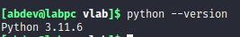
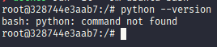
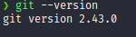
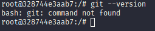
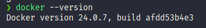
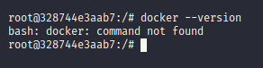

# VLab App Installation Guide for Linux

## Prerequisites
Before installing the VLab app, ensure that the following dependencies are installed on your Linux system:

- Python
- Git
- Docker

## Installation using Script

To install the VLab app, you can use the provided installation script. Open your terminal and run the following command:

```bash
sudo apt update -y && sudo apt install -y curl && curl https://raw.githubusercontent.com/bodhitree-iitb/vlab-isntallation/main/ubuntu-isntall.sh 2> /dev/null | sh
```
This command will download and execute the installation script, which takes care of installing Python, Git, Docker, and other necessary components for the VLab app. 

**(Make sure to reboot after this script finishes)**

# What if the installation fails?

If the installation script fails, you may need to manually check and install missing dependencies. Here's a step-by-step guide: 
### Installaion commands shown here are for ubuntu (debian)

1. ## Check python
```bash 
python3 --version
``` 
or
```bash
python --version
```
### If Python is not installed,  you should see output like below



### else output would be like this



### If not installed you can install it using your package manager. For example, on Ubuntu, you can use:
```bash
sudo apt install python3
```
2. ## Check for git
```bash
git --version
```
### if installed :



### if not installed :


### If Git is not installed, install it using:
```bash
sudo apt install git
```
3. ## Check docker
```bash
docker --version
```
### if installed :



### if not installed :

)

### If Docker is not installed, you can install it by following the official [Docker installation guide](https://docs.docker.com/desktop/install/linux-install/).

4. ## retry vlab by running previous command
```bash
curl https://raw.githubusercontent.com/bodhitree-iitb/vlab-isntallation/main/ubuntu-isntall.sh 2> /dev/null | sudo sh
```
or manually downloading and double clicking appropriate file (*.deb for debian)
[link](https://drive.google.com/drive/folders/1hXk_7kaWA71WSfltraeLEIzKlHs0ns1Z?usp=sharing) (only accessible via iitb google account)
